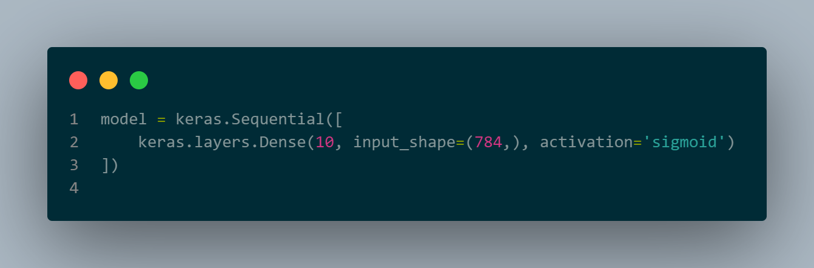

# Digit Classification using tensorflow and Keras
This repository consists the deep learning model for a digit classifier.

The dataset is downloaded in the code itself and stored inside variables. So there is not need to download any dataset manually.

The model has been made using neural networks.

# Dataset
The dataset contains images like this, each of which represents an integer between 0 and 9.

The dataset contains a set of 70000 images, 60000 of which will be used in the training set, and 10000 will be used for testing.

# Models

## Model 1
The first model is a basic one, containing only an input layer and an output layer.

This model gives an accuracy of 92%.

Heatmap with model 1 - 

## Model 2
The second model uses a hidden layer between the input and output layers.

this model gives an accuracy of 98%.

Heatmap with model 2 -

# Result

We can see that the second model performs better than the first model as it is more complex.