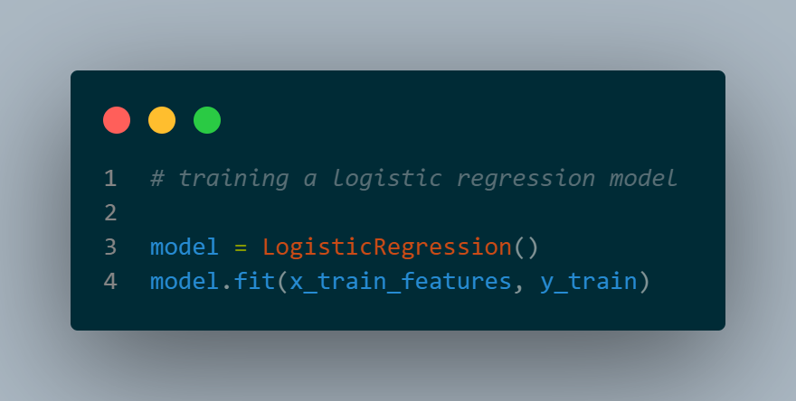

# Email Spam Classifier
This repository consists the dataset and a machine learning model for a email spam classifier.

The model has been made using logistic regression.

# Dataset 
The dataset contains 5570 rows containing email content and labels, telling if the mail is spam or not.

Here is a glimpse of the dataset.

<table border="1" class="dataframe">
  <thead>
    <tr style="text-align: right;">
      <th></th>
      <th>Category</th>
      <th>Message</th>
    </tr>
  </thead>
  <tbody>
    <tr>
      <th>0</th>
      <td>ham</td>
      <td>Go until jurong point, crazy.. Available only ...</td>
    </tr>
    <tr>
      <th>1</th>
      <td>ham</td>
      <td>Ok lar... Joking wif u oni...</td>
    </tr>
    <tr>
      <th>2</th>
      <td>spam</td>
      <td>Free entry in 2 a wkly comp to win FA Cup fina...</td>
    </tr>
    <tr>
      <th>3</th>
      <td>ham</td>
      <td>U dun say so early hor... U c already then say...</td>
    </tr>
    <tr>
      <th>4</th>
      <td>ham</td>
      <td>Nah I don't think he goes to usf, he lives aro...</td>
    </tr>
    <tr>
      <th>5</th>
      <td>spam</td>
      <td>This is the 2nd time we have tried 2 contact u...</td>
    </tr>
    <tr>
      <th>6</th>
      <td>ham</td>
      <td>Will ü b going to esplanade fr home?</td>
    </tr>
    <tr>
      <th>7</th>
      <td>ham</td>
      <td>Pity, * was in mood for that. So...any other s...</td>
    </tr>
    <tr>
      <th>8</th>
      <td>ham</td>
      <td>The guy did some bitching but I acted like i'd...</td>
    </tr>
    <tr>
      <th>9</th>
      <td>ham</td>
      <td>Rofl. Its true to its name</td>
    </tr>
  </tbody>
</table>

5572 rows × 2 columns

# Model

We are going to use a logistic regression model for this dataset model because we want to make a classification model that helps us classify the spams mails from the non-spam mails.

# Results

Using our model, we get a accyracy of 97% on our test set.