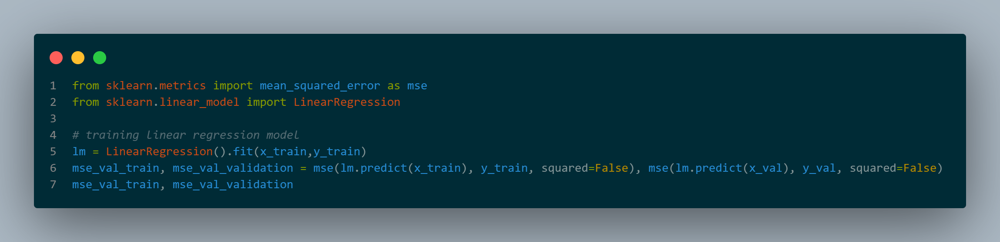
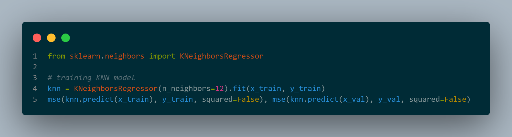
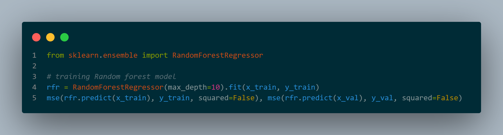
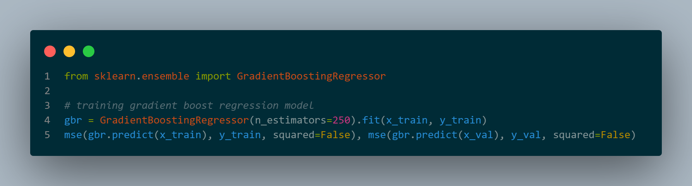

# Housing_Price_Prediction
Predicting Housing Prices using a dataset from California

# Dataset
The dataset contains details of more than 20000 houses. These details include importamt factors like number of bedrooms, location of the house, nearby localities, etc which are the deciding factors in determining the price of the house. A glimpse of the dataset can be seen below.

<table border="1" class="dataframe">
  <thead>
    <tr style="text-align: right;">
      <th></th>
      <th>longitude</th>
      <th>latitude</th>
      <th>housing_median_age</th>
      <th>total_rooms</th>
      <th>total_bedrooms</th>
      <th>population</th>
      <th>households</th>
      <th>median_income</th>
      <th>&lt;1H OCEAN</th>
      <th>INLAND</th>
      <th>ISLAND</th>
      <th>NEAR BAY</th>
      <th>NEAR OCEAN</th>
      <th>median_house_value</th>
    </tr>
  </thead>
  <tbody>
    <tr>
      <th>1</th>
      <td>-118.36</td>
      <td>34.06</td>
      <td>39.0</td>
      <td>2810.0</td>
      <td>670.0</td>
      <td>1109.0</td>
      <td>624.0</td>
      <td>3.2500</td>
      <td>1</td>
      <td>0</td>
      <td>0</td>
      <td>0</td>
      <td>0</td>
      <td>355000.0</td>
    </tr>
    <tr>
      <th>2</th>
      <td>-119.78</td>
      <td>36.78</td>
      <td>37.0</td>
      <td>2185.0</td>
      <td>455.0</td>
      <td>1143.0</td>
      <td>438.0</td>
      <td>1.9784</td>
      <td>0</td>
      <td>1</td>
      <td>0</td>
      <td>0</td>
      <td>0</td>
      <td>70700.0</td>
    </tr>
    <tr>
      <th>3</th>
      <td>-122.42</td>
      <td>37.73</td>
      <td>46.0</td>
      <td>1819.0</td>
      <td>411.0</td>
      <td>1534.0</td>
      <td>406.0</td>
      <td>4.0132</td>
      <td>0</td>
      <td>0</td>
      <td>0</td>
      <td>1</td>
      <td>0</td>
      <td>229400.0</td>
    </tr>
    <tr>
      <th>4</th>
      <td>-122.28</td>
      <td>37.81</td>
      <td>52.0</td>
      <td>340.0</td>
      <td>97.0</td>
      <td>200.0</td>
      <td>87.0</td>
      <td>1.5208</td>
      <td>0</td>
      <td>0</td>
      <td>0</td>
      <td>1</td>
      <td>0</td>
      <td>112500.0</td>
    </tr>
    <tr>
      <th>5</th>
      <td>-118.13</td>
      <td>33.82</td>
      <td>37.0</td>
      <td>1530.0</td>
      <td>290.0</td>
      <td>711.0</td>
      <td>283.0</td>
      <td>5.1795</td>
      <td>1</td>
      <td>0</td>
      <td>0</td>
      <td>0</td>
      <td>0</td>
      <td>225400.0</td>
    </tr>
    <tr>
      <th>6</th>
      <td>-117.88</td>
      <td>33.76</td>
      <td>17.0</td>
      <td>1768.0</td>
      <td>474.0</td>
      <td>1079.0</td>
      <td>436.0</td>
      <td>1.7823</td>
      <td>1</td>
      <td>0</td>
      <td>0</td>
      <td>0</td>
      <td>0</td>
      <td>205300.0</td>
    </tr>
    <tr>
      <th>7</th>
      <td>-119.63</td>
      <td>34.42</td>
      <td>42.0</td>
      <td>1765.0</td>
      <td>263.0</td>
      <td>753.0</td>
      <td>260.0</td>
      <td>8.5608</td>
      <td>1</td>
      <td>0</td>
      <td>0</td>
      <td>0</td>
      <td>0</td>
      <td>500001.0</td>
    </tr>
    <tr>
      <th>8</th>
      <td>-118.26</td>
      <td>33.93</td>
      <td>42.0</td>
      <td>1433.0</td>
      <td>295.0</td>
      <td>775.0</td>
      <td>293.0</td>
      <td>1.1326</td>
      <td>1</td>
      <td>0</td>
      <td>0</td>
      <td>0</td>
      <td>0</td>
      <td>104800.0</td>
    </tr>
    <tr>
      <th>9</th>
      <td>-117.16</td>
      <td>33.73</td>
      <td>10.0</td>
      <td>2381.0</td>
      <td>454.0</td>
      <td>1323.0</td>
      <td>477.0</td>
      <td>2.6322</td>
      <td>0</td>
      <td>1</td>
      <td>0</td>
      <td>0</td>
      <td>0</td>
      <td>140700.0</td>
    </tr>
    <tr>
      <th>10</th>
      <td>-122.20</td>
      <td>37.79</td>
      <td>35.0</td>
      <td>1802.0</td>
      <td>459.0</td>
      <td>1009.0</td>
      <td>390.0</td>
      <td>2.3036</td>
      <td>0</td>
      <td>0</td>
      <td>0</td>
      <td>1</td>
      <td>0</td>
      <td>126000.0</td>
    </tr>
  </tbody>
</table>

# Models
We have trained four models on this dataset.

## Linear Regression

## KNN Regression

## Random Forest Regression

## Gradient Boost Regression
